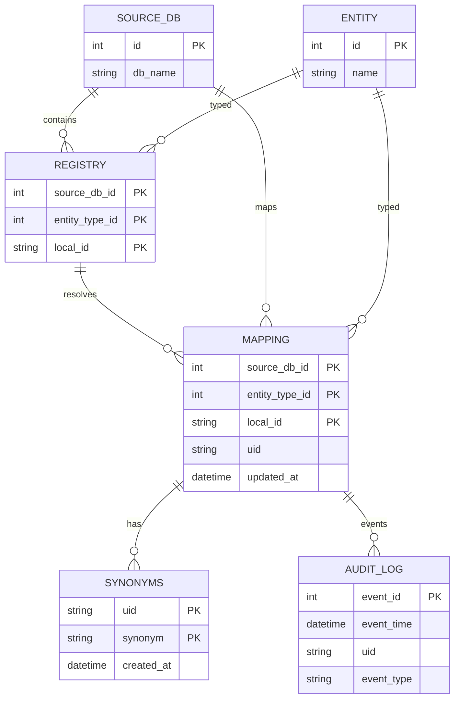

# Registry Scripts

Utilities in `scripts/` manage registry ingestion, bulk partner syncs, and cleanup tasks against the interoperable DB.

## Setup
- From `scripts/`, install dependencies: `pip install -r requirements.txt`.
- Configure `scripts/.env`:
  - `CONNECTION_MODE`: `azure` (uses Azure Key Vault for password) or `local`.
  - For Azure: set `DB_HOST`, `DB_NAME`, `DB_USERNAME`, `KEYVAULT_NAME`, `KEYVAULT_SECRET_NAME`; ensure your identity can read the secret and connect to the DB.
  - For local: set `LOCAL_DB_HOST`, `LOCAL_DB_PORT`, `LOCAL_DB_NAME`, `LOCAL_DB_USERNAME`, `LOCAL_DB_PASSWORD`.
- Run commands from the `scripts/` directory so relative imports and example paths resolve.

## CLI usage (`interop_utils.py`)
- Ingest example: `python interop_utils.py --ingest examples/example_ingest.json`
- Bulk ingest from all databases: `python interop_utils.py --ingest-bulk`
- Cleanup specific UIDs: `python interop_utils.py --cleanup examples/example_cleanup.json`
- Cleanup all registry and mappings (destructive): `python interop_utils.py --cleanup-all`
- List current mappings: `python interop_utils.py --list`

## Data contracts
- Ingest file (`entities` list):
  - Required: `source_db`
  - Either `entity_type` (`gene` or `strain`) with `local_id`, or provide both `gene_id` and `strain_id` (treated as gene lookup).
  - Optional: `synonyms` as string or list; blank and `None` values are ignored.
- Cleanup file: `uids` array of registry UIDs (see `examples/example_cleanup.json`).

## Behavior details
- UID generation: stable SHA256-derived IDs with `G-` or `S-` prefix; existing mappings are updated, and synonyms are deduplicated.
- External IDs: when `gene_id` and `strain_id` are provided, the ingest flow attempts to fetch synonyms from NCBI and UniProt before writing.
- Audit log: new mappings write one row to `audit_log` with `event_type` `Ingest`; cleanup writes `Removed` per deleted UID. Columns: `event_id` (auto), `event_time`, `uid`, `event_type`.
- Bulk ingest sources:
  - ALEdb strains and genes: `https://aledb.org/interop-query`
  - PMKbase strains (genes disabled): `https://www.pmkbase.com/interop-query`
  - Pankb strains and genes: `http://pankb-preprod.northeurope.cloudapp.azure.com/interop-query`
  - BiGG strains and genes: `http://biggr-prod.northeurope.cloudapp.azure.com/interop-query`
- Data hygiene in bulk mode: gene IDs are trimmed at whitespace, stripped of non-word characters except hyphen, and lower/upper casing is preserved from the source.
- Transactions and batching: ingest commits per batch (default 5,000 rows); cleanup commits per UID. Failures roll back the in-flight batch/UID and continue.

## Data model

- `entity`: canonical resource types (`gene`, `strain`).
- `source_db`: partner datasets (BiGG, ALEdb, PMKbase, Pankb, etc.).
- `registry`: composite key of source DB, entity type, and local ID.
- `mapping`: adds a UID and timestamp to a registry entry; composite PK matches `registry`.
- `synonyms`: alternate identifiers keyed by UID; no enforced FK but stored against mapping UIDs.
- `audit_log`: append-only events; ingest writes `Ingest`, cleanup writes `Removed`, keyed by UID (no FK).

## Safety notes
- `--cleanup-all` wipes `Synonym`, `Mapping`, and `Registry`; use only for environment resets.
- `--list` performs an unpaged full scan; avoid on large datasets.
- Bulk ingest depends on external APIs; rerunning is safe because duplicates are merged and updates are idempotent by UID.
