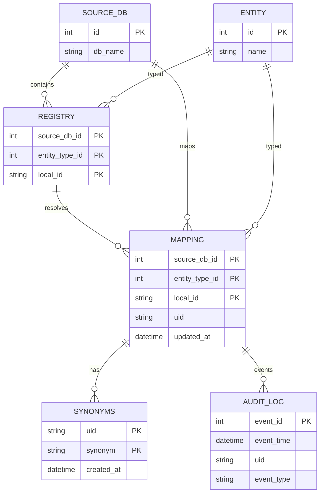

# Registry Scripts

Utilities in `scripts/` manage registry ingestion, bulk partner syncs, and cleanup tasks against the interoperable DB.

## Setup
- From `scripts/`, install dependencies: `pip install -r requirements.txt`.
- Configure `scripts/.env`:
  - `CONNECTION_MODE`: `azure` (uses Azure Key Vault for password) or `local`.
  - For Azure: set `DB_HOST`, `DB_NAME`, `DB_USERNAME`, `KEYVAULT_NAME`, `KEYVAULT_SECRET_NAME`; ensure your identity can read the secret and connect to the DB.
  - For local: set `LOCAL_DB_HOST`, `LOCAL_DB_PORT`, `LOCAL_DB_NAME`, `LOCAL_DB_USERNAME`, `LOCAL_DB_PASSWORD`.
- Run commands from the `scripts/` directory so relative imports and example paths resolve.

## CLI usage (`interop_utils.py`)
- Ingest example: `python interop_utils.py --ingest examples/example_ingest.json`
- Bulk ingest from all databases: `python interop_utils.py --ingest-bulk`
- Cleanup specific UIDs: `python interop_utils.py --cleanup examples/example_cleanup.json`
- Cleanup all registry and mappings (destructive): `python interop_utils.py --cleanup-all`
- List current mappings: `python interop_utils.py --list`

## Data contracts
- Ingest file (`entities` list):
  - Required: `source_db`
  - Either `entity_type` (`gene` or `strain`) with `local_id`, or provide both `gene_id` and `strain_id` (treated as gene lookup).
  - Optional: `synonyms` as string or list; blank and `None` values are ignored.
- Cleanup file: supports both full UID deletion and synonym-only deletion (see `examples/example_cleanup.json`).
  - `uids`: array of UIDs to delete entirely (removes synonyms, mapping, registry; logs `Removed`).
  - `synonyms`: delete specific synonyms without deleting UIDs; logs `Removed synonym <value>` per synonym.
    Accepted shapes:
    - Object map: `{ "UID": ["syn1", "syn2"], ... }`
    - List of objects: `[ {"uid": "UID", "synonym": "syn1"}, {"uid": "UID", "synonyms": ["syn2","syn3"]} ]`
    - List of pairs: `[ ["UID", "syn1"], ["UID2", "syn2"] ]`

## Behavior details
- UID generation: stable SHA256-derived IDs with `G-` or `S-` prefix; existing mappings are updated, and synonyms are deduplicated.
- External IDs: when `gene_id` and `strain_id` are provided, the ingest flow attempts to fetch synonyms from NCBI and UniProt before writing.
- Audit log: new mappings write one row to `audit_log` with `event_type` `Ingest`; cleanup writes `Removed` per deleted UID and `Removed synonym <value>` for each synonym deleted for that UID. Columns: `event_id` (auto), `event_time`, `uid`, `event_type`.
- Bulk ingest sources:
  - ALEdb strains and genes: `https://aledb.org/interop-query`
  - PMKbase strains (genes disabled): `https://www.pmkbase.com/interop-query`
  - Pankb strains and genes: `https://pankb.org/interop-query`
  - BiGG strains and genes: `http://biggr-prod.northeurope.cloudapp.azure.com/interop-query`
- Data hygiene in bulk mode: gene IDs are trimmed at whitespace, stripped of non-word characters except hyphen, and lower/upper casing is preserved from the source.
- Transactions and batching: ingest commits per batch (default 5,000 rows); cleanup commits per UID. Failures roll back the in-flight batch/UID and continue.

## UID Merge and Split

Merging and splitting are operational conventions implemented via synonyms; the underlying UID assignments in `mapping` are not rewritten.

Merge UIDs (connect records)
- Intent: declare that two or more UIDs refer to the same conceptual entity for lookup/joins.
- How: ensure the UIDs share at least one identical synonym string.
  - Add a synonym to UID A that already exists under UID B, or
  - Add the exact UID string of B (e.g., `G-XXXXXXX`) as a synonym of A (or vice versa), or
  - Add a new common synonym to both A and B.
- Do it via ingest by re-ingesting the entity that produces the target UID and supplying the desired synonym(s).

Example (add shared synonyms)
```json
{
  "entities": [
    { "source_db": "ALEdb", "entity_type": "gene", "local_id": "rpoB", "synonyms": ["G-OTHERUID", "rpoB_alt"] }
  ]
}
```
Run: `python interop_utils.py --ingest examples/example_ingest.json`

Split UIDs (disconnect records)
- Intent: remove unintended connections created by shared synonyms.
- How: use cleanup with the `synonyms` section to remove only specific (uid, synonym) pairs without deleting the UIDs.

Accepted cleanup shapes and example
```json
{
  "synonyms": [
    ["G-6EE9A9CD", "shared_syn"],
    { "uid": "G-12455", "synonyms": ["synonym2", "synonym3"] },
    { "uid": "G-6EE9A9CD", "synonym": "G-OTHERUID" }
  ]
}
```
Run: `python interop_utils.py --cleanup examples/example_cleanup.json`

Auditing and verification
- Ingest writes `Added synonym <value>` for each newly inserted synonym and `Ingest` for new mappings.
- Cleanup writes `Removed` for full UID deletions and `Removed synonym <value>` for synonym-only deletions.
- Verify via:
  - `SELECT * FROM synonyms WHERE uid IN ('G-...','G-...') ORDER BY uid, synonym;`
  - `SELECT event_time, uid, event_type FROM audit_log WHERE uid = 'G-...' ORDER BY event_time DESC;`

## Data model



- `entity`: canonical resource types (`gene`, `strain`).
- `source_db`: partner datasets (BiGG, ALEdb, PMKbase, Pankb, etc.).
- `registry`: composite key of source DB, entity type, and local ID.
- `mapping`: adds a UID and timestamp to a registry entry; composite PK matches `registry`.
- `synonyms`: alternate identifiers keyed by UID; no enforced FK but stored against mapping UIDs.
- `audit_log`: append-only events; ingest writes `Ingest`, cleanup writes `Removed`, keyed by UID (no FK).

## Safety notes
- `--cleanup-all` wipes `Synonym`, `Mapping`, and `Registry`; use only for environment resets. Before deletion, it logs one audit event per synonym ("Removed synonym <value>") and one per UID ("Removed").
- `--list` performs an unpaged full scan; avoid on large datasets.
- Bulk ingest depends on external APIs; rerunning is safe because duplicates are merged and updates are idempotent by UID.
